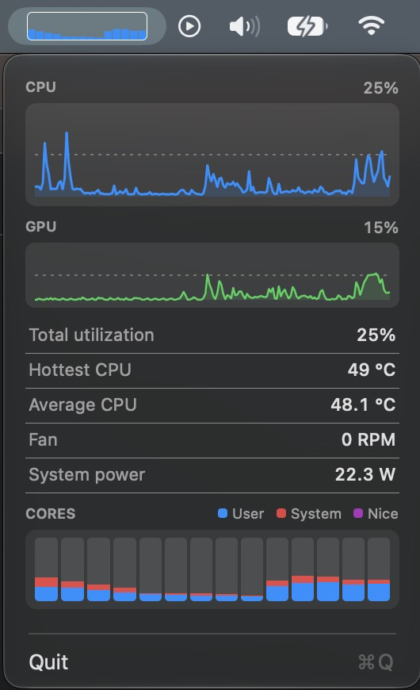

# rasitop



rasitop is a low-overhead macOS menu bar monitor for Apple Silicon. A Rust
sampling engine reads CPU, GPU, temperature, fan, and power telemetry.

My usecase is for spotting runaway processes pinning a CPU core.

Requires macOS, Xcode command-line tools, Rust, and
[`just`](https://github.com/casey/just). A nix shell also provides any dependencies needed.

```sh
just          # list commands
just build
just check
just preview  # open the live-data preview
just install  # install rasitop.app
```

Inspired by [macmon](https://github.com/vladkens/macmon) and
[Stats](https://github.com/exelban/stats).
